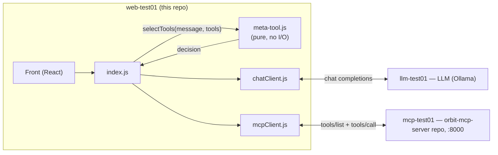
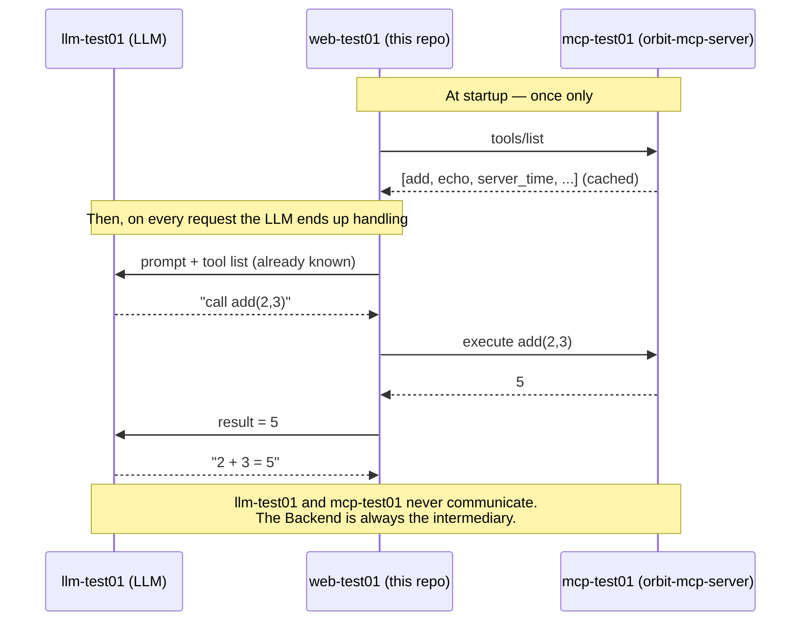
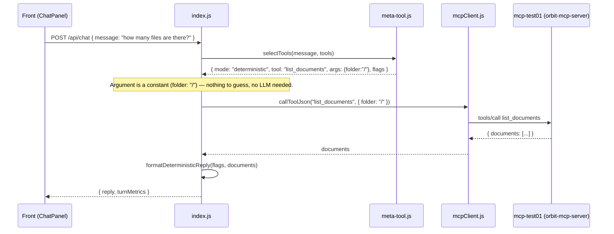
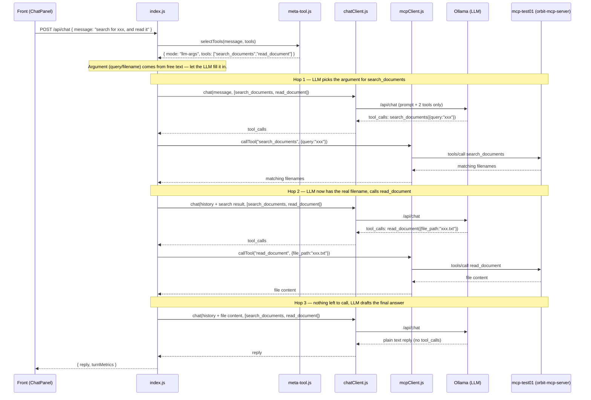
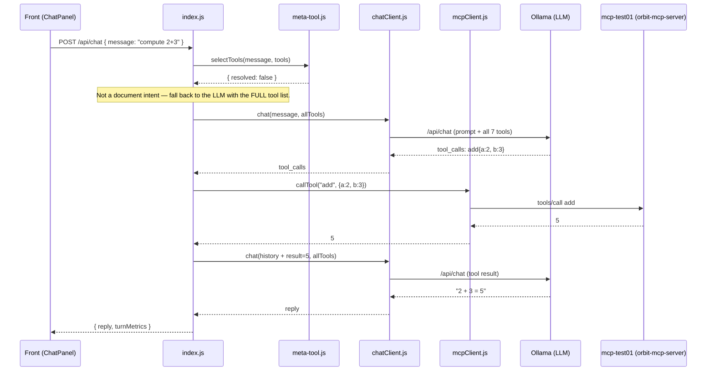

# Orbit Dashboard

Orbit Dashboard is a web app for monitoring an LLM-backed chatbot. You chat with a
language model, and a live dashboard shows the cost, latency, and token usage of
each message.

The project is two separate programs in one repo:

| Part | Folder | Role |
|------|--------|------|
| Frontend | [`src/`](src/) | React UI the user sees in the browser |
| Backend | [`nasa-back/`](nasa-back/) | Node/Express server that orchestrates the LLM and tool calls |

They communicate over HTTP. The frontend never talks to the LLM or the tool server
directly — it only ever calls its own backend.

## Architecture

Orbit Planner runs on 3 VMs. This repo is `web-test01` (front + backend). The other
two are separate services on separate VMs, each with its own repo:

- **Ollama (LLM)**, `llm-test01` — runs the language model (open source to avoid cost)
  instead of calling a hosted provider.
- **[orbit-mcp-server](https://github.com/AyoubProjects28/orbit-mcp-server)**,
  `mcp-test01` — exposes "tools" the model can call (document search/read, plus a few
  test tools), using the Model Context Protocol.

**This backend is the only thing that talks to either of them — the LLM and the MCP
server never talk to each other directly.**



`meta-tool.js` is a pure function with no I/O — it never calls the LLM or the MCP
server itself. Given the raw message and the live tool list, it only decides **which**
tool(s) might be relevant (never their arguments). `index.js` is the only file that
actually executes anything: for a fully deterministic decision (nothing to guess from
free text) it calls `mcpClient.js` directly with zero LLM calls; otherwise it restricts
the LLM tool-calling loop to just the candidate tool(s) `meta-tool.js` named, so the LLM
only fills in the argument instead of choosing from all 7 tools. If `meta-tool.js` can't
classify the message, control passes to the LLM with the full tool list, exactly as if
`meta-tool.js` didn't exist. See [Request flow](#request-flow-meta-tooljs-and-the-three-paths) below.

**Why the LLM and the MCP server never talk directly:**

- **Technical** — the LLM is a text function: text in, text out. No network, no
  runtime, no token. All it can do is write "I'd like to call `add(2,3)`".
- **Security** — the real reason. You don't want the manipulable component (the LLM)
  holding the keys to real actions. This backend checks the token, decides what's
  allowed, and logs everything. A prompt injection can't reach the MCP server directly.
- **Protocol** — the LLM speaks "chat completions", the MCP server speaks MCP. This
  backend translates between the two.

### Startup handshake

At startup, `index.js` does `tools/list` against the MCP server once and caches the
result — that's why it already knows `add / echo / server_time / attest_execution /
list_documents / search_documents / read_document` before any request.



## Frontend (`src/`)

Built with **React 19** and **Vite** (dev server + build tool), charts via **Recharts**.

- [`src/main.jsx`](src/main.jsx) — mounts the React tree into `index.html`'s single
  `<div id="root">`. This is a single-page app; everything is rendered by JavaScript.
- [`src/App.jsx`](src/App.jsx) — the root component. Holds the `metrics` and `error`
  state, fetches metrics once on mount, then polls every 12 seconds. Renders
  `ChatPanel` alongside the metric panels.
- [`src/api/`](src/api/) — thin wrappers around `fetch`:
  - [`metrics.js`](src/api/metrics.js) — `GET /api/metrics`
  - [`chat.js`](src/api/chat.js) — `POST /api/chat`

  These call `/api/*` with no host or port. Vite's dev server proxies `/api/*` to
  `localhost:3001` (see [`vite.config.js`](vite.config.js)); nginx does the same in
  production. The API endpoint is only known in these two files.
- [`src/components/`](src/components/) — one file per panel, each a stateless
  component driven entirely by a `data` prop:
  - [`ChatPanel.jsx`](src/components/ChatPanel.jsx) — the chat UI. Owns its own
    message list, sends messages, and calls `onMessageSent()` after each reply so
    `App.jsx` knows to refresh the dashboard.
  - [`SummaryBar.jsx`](src/components/SummaryBar.jsx) — total cost and average
    cost per request.
  - [`LatencyPanel.jsx`](src/components/LatencyPanel.jsx),
    [`TokensPanel.jsx`](src/components/TokensPanel.jsx),
    [`CostPanel.jsx`](src/components/CostPanel.jsx) — charts and detail stats
    for each metric category.
  - [`HardwarePanel.jsx`](src/components/HardwarePanel.jsx) — GPU/CPU/RAM chart.
    **Currently disabled** in `App.jsx` because the hardware numbers are still
    mocked; kept in the tree for when real measurement lands.

## Backend (`nasa-back/`)

A **Node.js + Express** server that orchestrates the chat flow.

- [`index.js`](nasa-back/index.js) — the server and orchestrator. Exposes:
  - `GET /api/metrics` — returns the current metrics snapshot.
  - `POST /api/chat` — first calls `meta-tool.selectTools()` (in-process, no network)
    to decide which tools, if any, are candidates for the message. Then either
    (a) executes a deterministic call itself with zero LLM calls, (b) runs the LLM
    tool-calling loop restricted to the candidate tool(s), or (c) runs the same loop
    with the full cached tool list if nothing was classified. See
    [Request flow](#request-flow-meta-tooljs-and-the-three-paths) below.

    The tool-calling loop itself: send the conversation + tool list to the LLM: if
    it replies with plain text, that's the final answer; if it asks to call tools,
    run each via `mcpClient.callTool()`, feed the results back into the conversation,
    and loop again — capped at `MAX_TOOL_HOPS = 4`.

    The LLM and the MCP server never talk to each other directly — this file is
    the only thing that routes tool calls between them. It also computes a
    latency breakdown: total wall-clock time minus pure LLM time gives the
    "overhead" (tool execution + orchestration) shown in the Latency panel.
- [`meta-tool.js`](nasa-back/meta-tool.js) — pure, synchronous decision module, no
  MCP or LLM calls, no `await`. `selectTools(message, tools)` classifies the message
  against known intents (count/volume/date/list/read/search) and returns which
  tool(s) are relevant, or `{ resolved: false }` if none match or the matched tool no
  longer exists in the live tool list (self-healing against tool renames on the MCP
  side). `formatDeterministicReply(flags, docs)` turns already-fetched data into the
  reply text for the deterministic tier.
- [`chatClient.js`](nasa-back/chatClient.js) — the only file that talks to the LLM.
  Sends the conversation and tool list to Ollama's `/api/chat`, reads back token
  counts, and computes cost. Configurable via `ORBIT_LLM_URL` / `ORBIT_LLM_MODEL`.
- [`mcpClient.js`](nasa-back/mcpClient.js) — the only file that speaks the MCP
  protocol. Connects and caches the tool list once at startup (`init()`); refuses
  to start without an `ORBIT_MCP_TOKEN`. `callTool()` runs a tool on demand.
- [`mock.js`](nasa-back/mock.js) — the in-memory metrics store (no database; resets
  on restart). Split into two halves:
  - **Hardware** metrics are fully mocked — re-randomized on every request to
    simulate fluctuating shared infrastructure.
  - **Latency, tokens, and cost** are event-driven and real — they only change
    when `recordChatTurn()` is called after an actual chat turn, accumulating
    totals and appending to a capped 20-point time series used by the charts.

  The file name and the `server` npm script predate this split — most of what it
  returns is now real, only hardware remains mocked.

## Request flow: meta-tool.js and the three paths

Every `POST /api/chat` starts the same way — `index.js` calls
`meta-tool.selectTools(message, tools)` — then follows one of three paths. A **hop** =
one round trip to the LLM inside the tool-calling loop.

### Deterministic answer, zero LLM calls (count / volume / date / list)



### Free-text argument, LLM restricted to the candidate tool(s) (read / search)

Example: *"search for the document xxx, and read it"* — `meta-tool.js` picks
`[search_documents, read_document]` up front; `index.js` gives the LLM only those two
tools instead of all 7, and lets it drive as many hops as it needs.



### No intent matched at all — full LLM tool-calling fallback



The second and third paths run through the exact same `runToolCallingLoop()` in
`index.js` — the only difference is which tools are passed to `chatClient.chat()` (a
couple, or all 7). The LLM always emits structured `tool_calls`, never free-form text
to parse, and it never reaches `mcp-test01` directly — everything goes through
`mcpClient.js`.

## Running it

Two processes, in separate terminals:

```bash
npm run server   # Express backend on :3001 (nasa-back/index.js)
npm run dev      # Vite frontend dev server, proxies /api → :3001
```

The backend requires `ORBIT_MCP_TOKEN` to be set, and reachable Ollama/MCP hosts, or
it will refuse to start.

## Notes

- The `nasa-back` / `nasa-front` naming and the `outDir: 'nasa-front'` build setting
  in [`vite.config.js`](vite.config.js) exist only to match folder names on the
  deployment VM (`web-test01`) — "Orbit" is the actual product name.
- Root [`package.json`](package.json) and [`nasa-back/package.json`](nasa-back/package.json)
  are two independent Node projects sharing one repo.
- No TypeScript — plain JavaScript (`.js`/`.jsx`). `@types/react` is a dev-only aid
  for editor tooling.

## Related repos

- [orbit-mcp-server](https://github.com/AyoubProjects28/orbit-mcp-server) — the
  `mcp-test01` tool server this backend calls. See that repo's README for the tools
  it exposes and its side of the security model.
